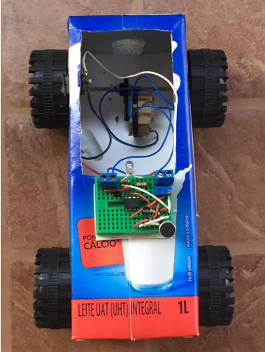
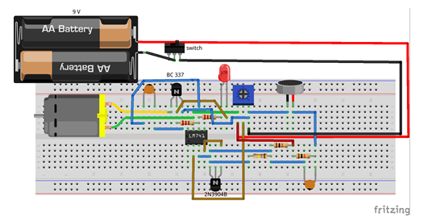

# Robô Caixa de Leite — Movido a Som (Grito)

> Protótipo educativo de eletrônica analógica: um carrinho que avança ao detectar um grito ou palma, construído sobre chassi de caixa de leite.

Desenvolvido pelo **PETEE-UFMG** em parceria com o **OptmaLab**.

---

<p align="center">
  
</p>

---

## Índice

1. [Visão Geral](#visão-geral)
2. [Objetivos Pedagógicos](#objetivos-pedagógicos)
3. [Pré-requisitos](#pré-requisitos)
4. [Como Funciona — Teoria](#como-funciona--teoria)
5. [Lista de Componentes](#lista-de-componentes)
6. [Esquema do Circuito](#esquema-do-circuito)
7. [Montagem Passo a Passo](#montagem-passo-a-passo)
8. [Testes e Calibração](#testes-e-calibração)
9. [Manutenção](#manutenção)
10. [Evolução do Projeto](#evolução-do-projeto)
11. [Guia do Facilitador](#guia-do-facilitador)
12. [Referências](#referências)

---

## Visão Geral

O Robô Caixa de Leite é um carrinho controlado por som. Quando alguém grita ou bate palmas próximo ao microfone, o circuito detecta o ruído, amplifica o sinal elétrico e ativa o motor DC — fazendo o carrinho avançar. Em silêncio, o carrinho permanece parado.

O projeto é intencionalmente simples e de baixo custo: o chassi é feito de caixa de leite e papelão, e o circuito é montado em protoboard, sem necessidade de solda. Isso torna o protótipo ideal para **oficinas, feiras de ciências e exposições**, onde alunos do ensino médio e do início da graduação podem construir, testar e entender cada etapa.

---

## Objetivos Pedagógicos

Este projeto cobre três grandes áreas do conhecimento em eletrônica e física:

### Física do Som
- Compreender que o som é uma onda de pressão mecânica que se propaga no ar
- Entender como um microfone de eletreto converte variação de pressão em sinal elétrico
- Relacionar a intensidade sonora (dB) com a amplitude do sinal elétrico gerado

### Eletrônica Analógica
- Entender o papel de um amplificador operacional (op-amp LM741) em condicionamento de sinal
- Aprender o conceito de ganho de tensão e o papel dos resistores de feedback
- Compreender como capacitores de acoplamento bloqueiam componentes DC e passam o sinal AC de áudio
- Entender a função de um transistor como chave eletrônica (corte e saturação)

### Sistemas Embarcados e Controle
- Relacionar a cadeia sensor → processamento → atuador com sistemas reais
- Aprender a ajustar um parâmetro de sistema (sensibilidade) via potenciômetro
- Desenvolver raciocínio de diagnóstico e manutenção de circuitos

---

## Pré-requisitos

| Perfil | Conhecimento esperado |
|---|---|
| Aluno do Ensino Médio | Lei de Ohm, conceito de circuito elétrico, o que é corrente e tensão |
| Aluno de Graduação (início) | Leis de Kirchhoff, noção de amplificador, familiaridade com protoboard |
| Facilitador / Monitor | Leitura de datasheet, familiaridade com multímetro e osciloscópio |

Não é necessário saber soldar — toda a montagem usa protoboard.

---

## Como Funciona — Teoria

O circuito é uma cadeia linear de quatro etapas:

```
 [Microfone]  →  [Amplificador LM741]  →  [Transistores BC337 + 2N3904]  →  [Motor DC]
   Sensor           Condicionamento              Chaveamento                   Atuador
```

### Etapa 1 — Captação do Som (Microfone de Eletreto)
O microfone de eletreto possui internamente um transistor FET e uma membrana polarizada. Quando a onda sonora comprime o ar próximo à membrana, a capacitância interna varia e gera uma corrente elétrica proporcional à pressão sonora. O sinal resultante é fraco (na faixa de milivolts) e precisa ser amplificado.

### Etapa 2 — Amplificação (LM741)
O LM741 é um amplificador operacional clássico, alimentado pela bateria de 9V. Os resistores de 180 kΩ e 10 kΩ formam a rede de feedback que define o **ganho** do amplificador:

```
Ganho ≈ R_feedback / R_entrada = 180 kΩ / 10 kΩ = 18 vezes
```

Os capacitores cerâmicos de 100 nF (104) atuam como filtros de acoplamento: bloqueiam a tensão DC de offset do microfone e deixam passar apenas o sinal AC de áudio que interessa.

> **Conceito-chave:** O potenciômetro de 10 kΩ não ajusta o ganho do LM741 diretamente — ele define o nível de tensão de referência na entrada inversora, funcionando como **limiar (threshold)**. Girar o potenciômetro regula quão alto o som precisa ser para o carrinho se mover.

### Etapa 3 — Chaveamento (Transistores)
O transistor 2N3904 recebe o sinal amplificado na base. Quando o sinal ultrapassa o limiar, o 2N3904 entra em saturação e conduz corrente para a base do BC337-25, que por sua vez conduz corrente suficiente para acionar o motor DC. Essa configuração em **Darlington** multiplica a capacidade de corrente e protege o LM741 de sobrecargas.

### Etapa 4 — Acionamento (Motor DC)
O motor DC de 6V–9V converte a energia elétrica em movimento mecânico, girando o eixo traseiro com engrenagem e movendo o carrinho para frente.

O LED no circuito serve como **indicador visual** de que o sistema está ligado e recebendo energia.

---

## Lista de Componentes

| # | Componente | Quantidade | Valor / Especificação | Função no Circuito |
|---|---|---|---|---|
| 1 | Microfone de eletreto | 1 | 6×3 mm com terminal | Capta o som e converte em sinal elétrico |
| 2 | Amplificador Operacional | 1 | LM741 (DIP-8) | Amplifica o sinal do microfone |
| 3 | Transistor NPN | 1 | BC337-25 | Chave de potência para o motor |
| 4 | Transistor NPN | 1 | 2N3904 | Pré-amplificador de corrente |
| 5 | Capacitor cerâmico | 2 | 104 (100 nF) | Acoplamento AC / filtragem |
| 6 | Resistor | 2 | 220 Ω | Limitação de corrente (LED e base) |
| 7 | Resistor | 2 | 10 kΩ | Polarização e rede de feedback |
| 8 | Resistor | 1 | 180 kΩ | Resistor de feedback do LM741 |
| 9 | Potenciômetro multivoltas | 1 | 10 kΩ | Ajuste do limiar de sensibilidade |
| 10 | LED 5 mm | 1 | Qualquer cor | Indicador de energia ligada |
| 11 | Chave gangorra | 1 | Liga/desliga | Controle de alimentação |
| 12 | Conector borne | 2 | — | Conexão do motor e bateria |
| 13 | Motor DC | 1 | 6V–9V | Atuador de movimento |
| 14 | Bateria | 1 | 9V | Alimentação geral do circuito |
| 15 | Rodas + eixo traseiro | 1 kit | Com engrenagem | Transmissão mecânica |
| 16 | Protoboard | 1 | 400 pontos (mínimo) | Base de montagem do circuito |
| 17 | Chassi | 1 | Caixa de leite + papelão | Estrutura do carrinho |

---

## Esquema do Circuito

<p align="center">
  
</p>

O diagrama acima foi gerado no **Fritzing** e mostra o layout exato das conexões no protoboard. Identifique cada componente pela posição e cor dos fios antes de montar.

**Legenda de cores dos fios (convenção adotada):**
- Vermelho → positivo (VCC / 9V)
- Preto → negativo (GND)
- Azul/Amarelo/Verde → sinais internos do circuito

---

## Montagem Passo a Passo

> Siga a ordem abaixo. Monte um bloco por vez e verifique continuidade antes de avançar para o próximo.

### 1. Preparação do Chassi
1. Lave e seque a caixa de leite de 1 L.
2. Reforce o fundo e as laterais com papelão colado.
3. Marque e faça os furos para os eixos das rodas traseiras e dianteiras.
4. Instale o eixo traseiro com a engrenagem e fixe as rodas.
5. Instale as rodas dianteiras giratórias.
6. Fixe o motor DC no interior do chassi, acoplado à engrenagem traseira.

### 2. Instalação do Protoboard
1. Posicione o protoboard no topo do chassi e fixe com fita dupla-face ou velcro.
2. Conecte os trilhos de alimentação: vermelho ao positivo (VCC) e preto ao negativo (GND).

### 3. Montagem do Amplificador (LM741)
1. Encaixe o LM741 no centro do protoboard, com o pino 1 (marca de identificação) voltado para a esquerda.
2. Conecte o pino 7 (V+) ao trilho VCC (+9V).
3. Conecte o pino 4 (V−) ao trilho GND.
4. Conecte o resistor de 180 kΩ entre os pinos 2 (entrada inversora) e 6 (saída).
5. Conecte um resistor de 10 kΩ entre o pino 2 e o GND.
6. Conecte o potenciômetro entre VCC e GND; ligue o terminal central ao pino 3 (entrada não-inversora).

### 4. Conexão do Microfone
1. Identifique os terminais do microfone: o terminal com marca (traço dourado) é o negativo (GND).
2. Conecte o terminal negativo ao GND.
3. Conecte o terminal positivo a um capacitor de 100 nF, cuja outra perna vai ao pino 2 do LM741.
4. Adicione um resistor de 10 kΩ entre o terminal positivo do microfone e o VCC (pull-up de polarização).

### 5. Montagem dos Transistores
1. Encaixe o 2N3904 no protoboard com o lado plano voltado para você.
   - Pino da esquerda: Emissor → GND
   - Pino do meio: Base → saída do LM741 (pino 6) via resistor de 220 Ω
   - Pino da direita: Coletor → base do BC337
2. Encaixe o BC337 (identificar emitter, base e collector pelo datasheet).
   - Emissor → GND
   - Base → coletor do 2N3904 via resistor de 220 Ω
   - Coletor → terminal negativo do motor

### 6. Conexão do Motor e Bateria
1. Conecte o terminal positivo do motor ao VCC.
2. Conecte o terminal negativo do motor ao coletor do BC337.
3. Instale a chave gangorra em série com o positivo da bateria.
4. Conecte a bateria 9V usando os bornes ou um conector de bateria.

### 7. LED Indicador
1. Conecte o ânodo (perna maior) do LED ao VCC via resistor de 220 Ω.
2. Conecte o cátodo (perna menor) ao GND.

### 8. Verificação Final
Antes de ligar, confira:
- [ ] Polaridade do microfone (negativo no GND)
- [ ] Orientação do LM741 (pino 1 identificado)
- [ ] Orientação dos transistores (emissor, base, coletor corretos)
- [ ] Polaridade da bateria (vermelho = positivo)
- [ ] Nenhum fio tocando trilhos indevidos no protoboard

---

## Testes e Calibração

### Teste 1 — Verificação de Energia
1. Ligue a chave gangorra.
2. O LED deve acender imediatamente.
3. Se o LED não acender: verifique a bateria, a chave e as conexões de alimentação.

### Teste 2 — Teste Isolado do Motor
1. Aplique 9V diretamente nos terminais do motor (sem o circuito).
2. O motor deve girar e as rodas traseiras devem se mover.
3. Se o motor não girar: troque a bateria ou verifique as engrenagens.

### Teste 3 — Teste de Resposta ao Som
1. Com o circuito ligado e o carrinho em superfície plana, fale alto próximo ao microfone.
2. O motor deve ativar e o carrinho deve avançar.
3. Se não responder: gire o potenciômetro no sentido anti-horário para aumentar a sensibilidade.
4. Se responder a qualquer ruído de fundo: gire o potenciômetro no sentido horário para aumentar o limiar.

### Calibração da Sensibilidade
O potenciômetro é o único parâmetro ajustável do sistema. Use a tabela abaixo como guia:

| Comportamento observado | Ajuste do potenciômetro |
|---|---|
| Não responde nem a gritos altos | Girar no sentido anti-horário (reduz limiar) |
| Responde a qualquer barulho de fundo | Girar no sentido horário (aumenta limiar) |
| Responde apenas a sons próximos | Comportamento ideal para exposições |
| Motor liga e não desliga | Possível oscilação — verificar capacitores |

---

## Manutenção

Esta seção destina-se a monitores, técnicos e facilitadores responsáveis pelo protótipo em eventos.

### Inspeção Visual (antes de cada uso)

- [ ] Verificar se todos os componentes estão firmes no protoboard (sem pinos dobrados ou mal encaixados)
- [ ] Confirmar que os fios de conexão não estão fraturados ou com isolamento partido
- [ ] Verificar a integridade do chassi (papelão, cola e travas das rodas)
- [ ] Confirmar que o eixo traseiro gira livremente e a engrenagem está encaixada
- [ ] Verificar nível de carga da bateria com multímetro (mínimo 7,5V em carga)

### Diagnóstico de Falhas

| Sintoma | Causa mais provável | Solução |
|---|---|---|
| LED não acende | Bateria fraca ou chave com defeito | Trocar bateria; testar chave com multímetro |
| Motor não gira | Bateria descarregada ou transistor BC337 aberto | Medir tensão no coletor do BC337; trocar transistor |
| Não responde ao som | Microfone ou LM741 com defeito | Testar microfone com multímetro em modo AC; substituir LM741 |
| Responde a ruído de fundo | Limiar muito baixo | Ajustar potenciômetro; verificar se capacitores estão corretos |
| Motor gira sem parar | Transistor 2N3904 em saturação permanente | Verificar resistor de 220 Ω da base; substituir 2N3904 |
| Carrinho não se move | Engrenagem desencaixada ou eixo preso | Verificar acoplamento mecânico motor-engrenagem |
| Sinal instável / oscilante | Mau contato no protoboard | Reencaixar componentes; limpar trilhos com borracha |

### Componentes e Vida Útil

| Componente | Vida útil esperada | Observação |
|---|---|---|
| Bateria 9V alcalina | 2–4 horas de uso contínuo | Sempre ter uma reserva em eventos |
| Microfone de eletreto | Longa (anos) | Sensível a umidade; guardar em local seco |
| LM741 | Muito longa | Pode queimar se houver inversão de polaridade |
| Transistores | Muito longa | Vulneráveis a descarga eletrostática (ESD) |
| Protoboard | 1–3 anos de uso intenso | Trilhos desgastados causam mau contato |
| Chassi de papelão | 6–12 meses | Reforçar com papelão extra se dobrar |

### Reparo e Reposição

1. **Troque componentes individualmente** — nunca substitua vários ao mesmo tempo; teste após cada troca.
2. **Mantenha sobressalentes**: ao menos 1 LM741, 2 transistores de cada tipo, e 2 baterias.
3. **Protoboard desgastado**: se o mau contato persistir mesmo após reencaixe, transfira o circuito para um novo protoboard.
4. **Evolução para placa de circuito impresso (PCB)**: após validar o projeto em múltiplas apresentações, considere soldar os componentes em uma placa para maior durabilidade.

---

## Evolução do Projeto

As melhorias abaixo estão organizadas por nível de dificuldade, servindo como desafios progressivos para alunos.

### Nível Iniciante
- Adicionar um segundo LED colorido que pisca enquanto o motor está ativo
- Modificar o chassi com decoração personalizada (tinta, adesivos)
- Experimentar diferentes tipos de microfone e comparar a sensibilidade

### Nível Intermediário
- Substituir o LM741 pelo **LM358** (mais moderno, single-supply, menor offset): permite alimentação simples de 5V–15V
- Adicionar um **filtro passa-baixa** (RC) na entrada para reduzir ruídos elétricos de alta frequência
- Incluir um **capacitor eletrolítico** de 10 µF em paralelo com o motor para suprimir a faísca de comutação

### Nível Avançado
- Implementar controle direcional com dois motores e dois microfones (um para cada lado)
- Adicionar um **Arduino Nano** para processar o sinal do microfone via ADC e implementar lógica mais complexa (parar após 3 segundos, detectar frequência específica)
- Reprojetar o chassi em **impressão 3D** para maior resistência e precisão dimensional
- Produzir uma **PCB customizada** no KiCad para eliminar o protoboard

---

## Guia do Facilitador

Esta seção é voltada para monitores e professores que usarão o projeto em oficinas ou eventos.

### Estrutura Sugerida de Oficina (2 horas)

| Tempo | Atividade |
|---|---|
| 0–15 min | Introdução: o que é som? Como o microfone funciona? |
| 15–30 min | Apresentação dos componentes e identificação no protoboard |
| 30–75 min | Montagem guiada em grupos de 3–4 alunos |
| 75–90 min | Testes, calibração e competição de "quem grita mais alto" |
| 90–120 min | Discussão: o que melhorar? Como funcionaria com Arduino? |

### Perguntas de Reflexão para os Alunos
- Por que o carrinho para quando paramos de falar? O que acontece com o sinal?
- O que acontece se ligarmos dois microfones ao mesmo circuito?
- Como poderíamos fazer o carrinho virar ao invés de só avançar?
- Qual a diferença entre usar um transistor como amplificador e como chave?

### Dicas para Eventos
- Ajuste o potenciômetro para um limiar **alto** antes de expor ao público — evita que barulho de fundo acione o carrinho o tempo todo.
- Marque o chassi com o número do grupo para facilitar identificação em feiras com múltiplos protótipos.
- Tenha um multímetro disponível para diagnóstico rápido.
- Coloque o carrinho em uma superfície levemente elevada (caixa ou rampa) para a demonstração ser mais visível ao público.

---

## Referências

- Projeto desenvolvido pelo **PETEE-UFMG** (Programa de Educação Tutorial de Engenharia Elétrica) em parceria com o **OptmaLab — UFMG**.
- Relatório técnico: *Carrinho Movido a Som* — documentação interna PETEE-UFMG.
- Datasheet LM741: [Texas Instruments — LM741 Operational Amplifier](https://www.ti.com/lit/ds/symlink/lm741.pdf)
- Datasheet BC337: [Fairchild Semiconductor — BC337 NPN Transistor](https://www.onsemi.com/pdf/datasheet/bc337-d.pdf)
- Datasheet 2N3904: [ON Semiconductor — 2N3904 NPN General Purpose Transistor](https://www.onsemi.com/pdf/datasheet/2n3904-d.pdf)
- Fritzing (ferramenta de diagramas de circuito): [fritzing.org](https://fritzing.org)
